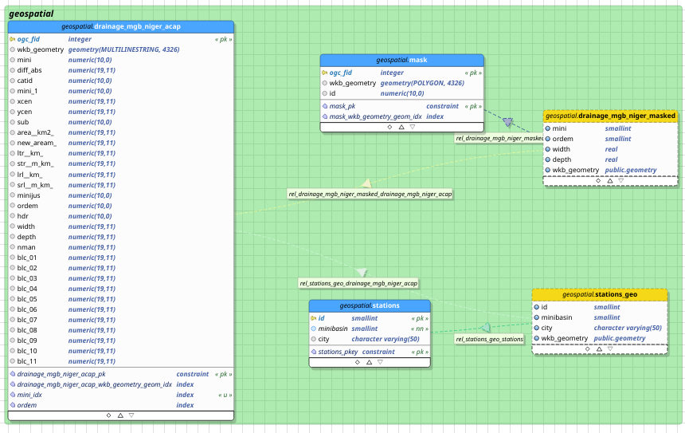
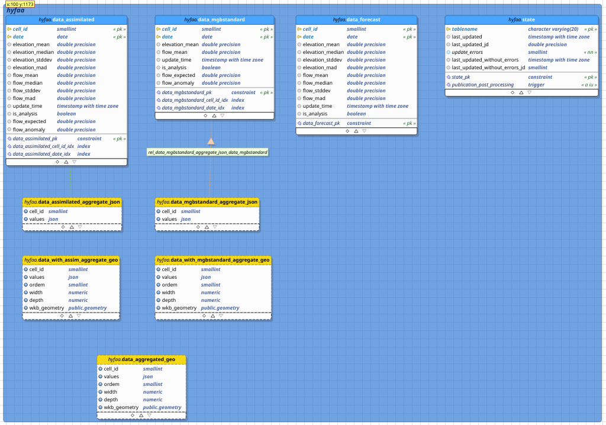
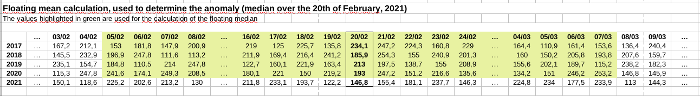

# Database Structure

The DB is constituted of 2 schemas: 
* hyfaa
* geospatial

## Geospatial schema

It is prepared with the `drainage_mgb_niger_acap` table, which is created using
 the eponym shapefile. It provides the linear geospatial description of the
 minibasins.

 Its geospatial elements will be filtered by
 * the ordem attribute (>=10)
 * a geographical exclusion mask
 
The output view is named `drainage_mgb_niger_masked`.

A second layer is the `stations`. Stations are virtual, they just serve to
 highlight some specific minibasins, located at strategical locations. The
  `stations` table is just a list of minibasins ids, with a label. The
   `stations_geo` view is then generated by joining the `stations` table and the
    drainage geospatial table.

## hyfaa schema

In the hyfaa schema, the entrypoint, for data, are the tables 
* `data_mgbstandard`: takes data from the mgb standard run
* `data_assimilated`: takes data from the hyfaa process, with assimilation
* `data_forecast`: takes "forecast" experimental data

There is a 4th table, `state`, that is used to track the publication state and 
identify which data from the netcdf files will be used to update the tables.

Both `data_mgbstandard` and `data_assimilated` have 2 fields, flow_expected and 
flow_anomaly, that are filled afterwards, computed from the published values. 
They are too computationally heavy to be computed in views.

Their computation is triggered by the triggers defined in 
[54_triggers_on_state.sql](../docker-entrypoint-initdb.d/54_triggers_on_state
.sql), on an update in the `state` table.
The functions used for the computation are defined in 
[22-mgb_hyfaa_custom_functions.sql](../docker-entrypoint-initdb.d/22-mgb_hyfaa_custom_functions.sql), 
based on the calculation of a floating median.

### Floating median: flow_expected

It is computed using the values of the days surrounding the current day of the 
year, but spanning over the previous years. It excludes the values from the 
recent days (say, not the current year, but also dealing with the possible 
side-effect when dealing around the first days of January).

This is the computationally expensive work.

### flow_anomaly

The anomaly is computed by 100 * (flow_current - flow_expected)/(flow_expected).

### Views

#### json aggregates

Upon the floating mean and anomaly calculation, a view is
preparing pre-digested json chunks for the next step towards
a geospatial layer: it aggregates, for each minibasin, the values (flow
& flow_anomaly) from the last 15 days. This is done for mgbstandard and
 assimilated data.
   
They are defined in 
[25-mgb_hyfaa_views.sql](../docker-entrypoint-initdb.d/25-mgb_hyfaa_views.sql).

This file also defines some data-access functions, used by the backend API
. They are quite self-explanatory, look at the comments.

#### geospatial materialized views

A join between the aggregated json data (see above) and the masked geospatial
 layer of the minibasins (see geospatial schema) is then done, using
  materialized views, both for mgbstandard and for assimilated data.

The materialized views are also updated by the same trigger as the floating
 median.
 
 They are defined in [53_drainage_sql_views.sql](../docker-entrypoint-initdb.d/53_drainage_sql_views.sql), but located in the `hyfaa` schema.

This is those views that will be available using pg_tileserv.

And additional view is created, `data_aggregated_geo`. This is the table used
 by default by the frontend map. This allows to quite easily change the
underlying layer: simply redefine this view to point to assimilated data if
you want to.